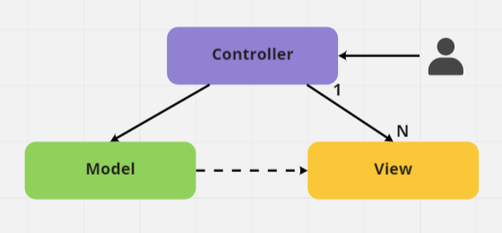

# 📌 디자인 패턴이란?

- 디자인 패턴은 건축으로치면 공법에 해당하는 것으로 소프트웨어의 개발 방법을 공식화 한 것이다. 소수의 뛰어난 엔지니어가 해결한 문제를 다수의 엔지니어들이 처리 할 수 있도록 한 규칙이면서, 구현자들 간의 커뮤니케이션의 효율성을 높이는 기법이다.
- 명확하게 정답이 있는 형태는 아니며, 프로젝트의 상황에 맞추어 적용 가능

## 🔍 사용 목적 및 이유

1. 우리 주변에서 자주 반복해서 발생하는 문제와 그 문제를 해결하는 핵심을 기술해 동일한 일을 두번 다시 하지 않고 해결할 수 있도록 한다.
2. 구체적인 설명 없이 구조화된 패턴에 대한 사전 지식으로 개발자 간에 커뮤니케이션이 수월하다.
3. 설계 과정의 속도를 높일 수 있다. 이미 검증된 구조이기 때문이다.

# 📌 MVC**(Model-View-Controller)** 패턴

- MVC 패턴은 Model + View + Controller를 합친 용어

## 🔍 구조

- Controller : 사용자의 입력을 받고 처리하고 뿌리는거 모두하는 부분 (Model과 View 사이에서 컨트롤)
- Model : 어플리케이션에서 사용되는 데이터와 그 데이터를 처리하는 부분
- View : 사용자에게 보여지는 UI 부분 (클라이언트 측 기술인 html/css/javascript들을 모아둔 컨테이너 / View는 Controller의 존재를 모른다 / View 는 Model 의 변화에 대해 직접적으로 알지 못한다 → 옵저버 패턴과 같은 방식으로 간접적으로 인지)

## 🔍 동작

1. 사용자의 입력들은 Controller에 들어오게 됩니다.
2. Controller는 사용자의 입력을 확인하고, Model을 업데이트합니다.
3. Controller는 Model을 나타내줄 View를 선택합니다.
4. View는 Model을 이용하여 화면을 나타냅니다.

## 🔍 특징

Controller는 여러개의 View를 선택할 수 있는 1:n 구조입니다.(m:n 다대다 관계일 수도 있다)
Controller는 View를 선택할 뿐 직접 업데이트 하지 않습니다. (View는 Controller를 알지 못합니다.)

## 🔍 장점

MVC 패턴의 장점은 널리 사용되고 있는 패턴이라는 점에 걸맞게 가장 단순합니다. 
단순하다 보니 보편적으로 많이 사용되는 디자인패턴입니다.
그리고 각 구성요소를 독립시킴으로써 각 팀으로 하여금 맡은 부분의 개발에만 따로 집중 할 수 있게 하여 개발의 효율성을 높일 뿐만 아니라. 개발 완료 후에도 유지보수성과 확장성을 보장한다.

## 🔍 단점

MVC 패턴의 단점은 View와 Model 사이의 의존성이 높다는 것입니다.
View와 Model의 높은 의존성은 어플리케이션이 커질 수록 복잡하지고 유지보수가 어렵게 만들 수 있습니다.
MVC 패턴의 경우에는 규모가 커질수록 Controller가 비대해져 복잡도가 증가한다.

# 📌 MVP**(Model-View-Presenter)** 패턴

- MVP 패턴은 Model + View + Presenter를 합친 용어
- MVC 패턴에서 Controller 대신 Presenter가 존재

## 🔍 구조

- Presenter : View에서 요청한 정보로 Model을 가공하여 View에 전달해 주는 부분 (ui 없이 로직이 존재 / Model 을 업데이트하고, 원하는 데이터를 가져온다)
- Model : 어플리케이션에서 사용되는 데이터와 그 데이터를 처리하는 부분
- View : 사용자에게 보여지는 UI 부분 (입력을 받는 부분 / Model의 존재를 모른다)

## 🔍 동작

1. 사용자의 입력들은 View를 통해 들어오게 됩니다.
2. View는 데이터를 Presenter에 요청합니다.
3. Presenter는 Model에게 데이터를 요청합니다.
4. Model은 Presenter에서 요청받은 데이터를 응답합니다.
5. Presenter는 View에게 데이터를 응답합니다.
6. View는 Presenter가 응답한 데이터를 이용하여 화면을 나타냅니다.

## 🔍 특징

Presenter는 View와 Model의 인스턴스를 가지고 있어 둘을 연결하는 접착제 역할을 합니다.
Presenter와 View는 1:1 관계입니다.

## 🔍 장점

MVP 패턴은 MVC 패턴의 단점이었던 View와 Model의 의존성을 해결하였습니다

## 🔍 단점

MVC 패턴의 단점인 View와 Model 사이의 의존성은 해결되었지만, View와 Presenter 사이의 의존성이 커지는 단점이 있습니다. 
어플리케이션이 복잡해 질 수록 View와 Presenter 사이의 의존성이 강해지는 단점이 있습니다.

# 📌 MVVM 패턴

- MVVM 패턴은 Model + View + View Model를 합친 용어입니다.
Model과 View은 다른 패턴과 동일합니다.
- MVP 패턴에서 Presenter가 ViewModel가 된 패턴

## 🔍 구조

- Model : 어플리케이션에서 사용되는 데이터와 그 데이터를 처리하는 부분입니다.
- View : 사용자에서 보여지는 UI 부분입니다. (입력을 ViewModel에 알림 / View는 ViewModel을 구독하고 있음)
- ViewModel : View를 표현하기 위해 만든 View를 위한 Model입니다. View를 나타내 주기 위한 Model이자 View를 나타내기 위한 데이터 처리를 하는 부분입니다. (ViewModel은 데이터를 바꾸기만함 / 어떤 화면을 그리라고 안알려줌)

## 🔍 동작

1. 사용자의 입력들은 View를 통해 들어오게 됩니다.
2. View에 입력이 들어오면, Command 패턴으로 View Model에 입력을 전달합니다.
3. View Model은 Model에게 데이터를 요청합니다.
4. Model은 View Model에게 요청받은 데이터를 응답합니다.
5. View Model은 응답 받은 데이터를 가공하여 저장합니다.
6. View는 View Model과 Data Binding하여 화면을 나타냅니다.

## 🔍 특징

MVVM 패턴은 [Command 패턴](https://ko.wikipedia.org/wiki/%EC%BB%A4%EB%A7%A8%EB%93%9C_%ED%8C%A8%ED%84%B4)과 [Data Binding](https://en.wikipedia.org/wiki/Data_binding) 두 가지 패턴을 사용하여 구현되었습니다.
Command 패턴과 Data Binding을 이용하여 View와 View Model 사이의 의존성을 없앴습니다.
View Model과 View는 1:n 관계입니다.

[[WEB] 양방향 단방향 데이터 바인딩](https://velog.io/@sunaaank/data-binding)

데이터 바인딩이란?

## 🔍 장점

MVVM 패턴은 View와 Model 사이의 의존성이 없습니다. 또한 Command 패턴과 Data Binding을 사용하여 View와 View Model 사이의 의존성 또한 없앤 디자인패턴입니다. 각각의 부분은 독립적이기 때문에 모듈화 하여 개발할 수 있습니다.

## 🔍 단점

MVVM 패턴의 단점은 View Model의 설계가 쉽지 않다는 점입니다.

# 👋 예상 질문

- MVC 패턴이 뭘까요?
    
    데이터를 처리하는 Model, 사용자에게 보여지는 화면 부분의 View, 입력을 받아 View에 전달하여 화면을 갱신하고 동시에 Model에 전달하여 데이터 처리까지하는 Controller를 사용하는 패턴입니다.
    각 구성요소를 나눔으로써 개발의 효율성을 높이면서 유지보수에도 유리한 패턴입니다.
    
- MVC, MVP, MVVM 패턴의 차이점이 뭘까요?
    
    MVC 패턴은 위에서 말한바와 동일하고 여기서 Controller 대신 Presenter를 통해서 Model과 View의 의존성을 없애면 MVP 패턴이 되고
    MVVM 패턴은 MVP 패턴에서 View와 Presenter의 강한 의존성을 ViewModel로 대체하여 데이터 바인딩을 통해 결합도를 낮춘 패턴입니다.
    
- 그렇다면 MVVM 패턴이 가장 좋은 패턴인가요?
    
    정답은 없다고 생각합니다.
    가장 단순한 MVC 패턴이 유리할수도 있고 View가 가장 가벼운 MVP 패턴이 디자인 재사용에 유리하여 좋을수도 디자인과 동작까지 재사용에 유리한 MVVM도 설계 자체가 어려울 수 있어 상황에 맞게 적절히 사용하는것이 좋다고 생각합니다.
    

# ✨ References

- MVC, MVP, MVVM 패턴 특징
    
    [[디자인패턴] MVC, MVP, MVVM 비교](https://beomy.tistory.com/43)
    
- 디자인 패턴이란
    
    [[Design Pattern] 디자인 패턴 이해 목적 및 사용 이유](https://developercc.tistory.com/17)
    
    [MVC 디자인 패턴 - 생활코딩](https://opentutorials.org/course/697/3828)
    
- 데이터 바인딩이란
    
    [[WEB] 양방향 단방향 데이터 바인딩](https://velog.io/@sunaaank/data-binding)